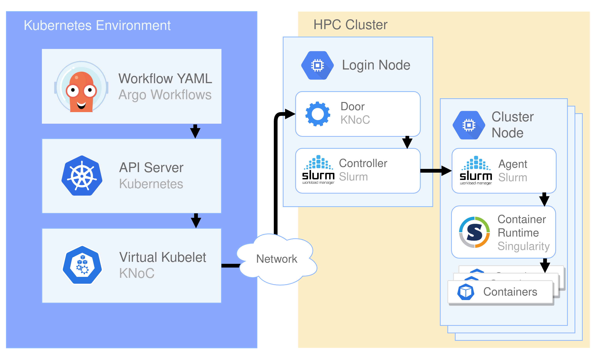

# KNoC - A Kubernetes Node to manage container lifecycle on HPC clusters

<!-- 
<picture>
  <source media="(prefers-color-scheme: dark)" srcset="media/darkcrop.png">
  <source media="(prefers-color-scheme: light)" srcset="media/lightcrop.png">
  
</picture> -->


KNoC is a [Virtual Kubelet](https://github.com/virtual-kubelet/virtual-kubelet) Provider implementation that manages
real pods and containers in a remote container runtime by supporting the lifecycle management of pods, containers and
other resources in the context of Kubernetes.

[Virtual Kubelet](https://github.com/virtual-kubelet/virtual-kubelet) is an open
source [Kubernetes](https://kubernetes.io/) kubelet implementation that masquerades as a kubelet for the purposes of
connecting Kubernetes to other APIs.

Remote environments include [Singularity](https://sylabs.io/singularity/) container runtime
utilizing [Slurm's](https://slurm.schedmd.com/) resource management and job scheduling

## Features

- Create, delete and update pods
- Container logs and exec
- Get pod, pods and pod status
- Support for EmptyDirs, Secrets and ConfigMaps



## Documentation

You can find all relative information
in [Documentation](https://github.com/CARV-ICS-FORTH/KNoC/blob/master/doc/README.md)


## Open tunnel to target infrastructure
```shell
ssh -L 0.0.0.0:30002:192.168.1.31:22 thegates

192.168.1.31 is the IP of the head/login node.

scp -P 7777 /tmp/hpk.sif localhost:~/
```


# Build locally and push to remote HPC
docker build . -t icsforth/hpk &&  singularity build /tmp/hpk.sif docker-daemon://icsforth/hpk:latest && scp /tmp/hpk.sif eupex@amonra.oats.inaf.it:~/

# On the HPC Cluster
singularity run --bind /bin,/boot,/etc,/home,/lib,/lib32,/lib64,/libx32,/lost+found,/media,/mnt,/opt,/proc,/root,/run,/sbin,/snap,/srv,/swap.img,/sys,/tmp,/usr,/var  hpk.sif

# jedi
singularity run --bind /bin,/boot,/etc,/home,/lib,/lib32,/lib64,/libx32,/lost+found,/media,/mnt,/opt,/proc,/root,/sbin,/snap,/srv,/swap.img,/sys,/tmp,/usr,/var  hpk.sif

