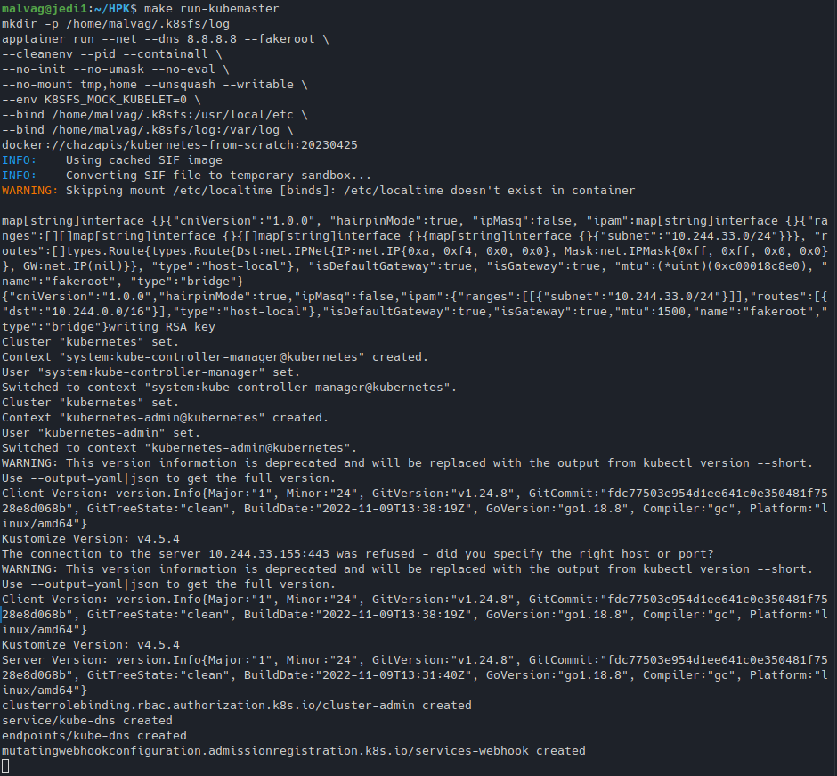
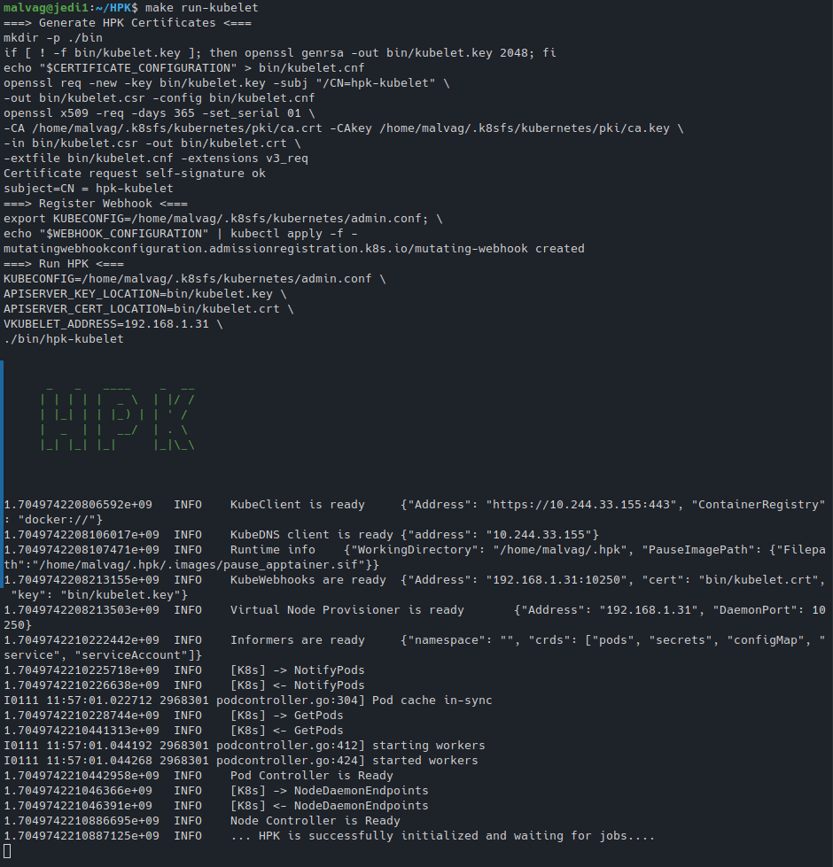
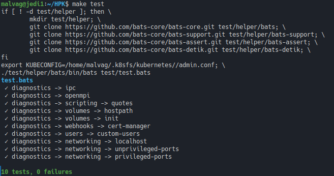

# Admin Guide

In this tutorial, we'll walk you through the setup process to get HPK up and operational.

> Tested on Ubuntu 20.04, CentOS 7.

## Requirements

| Variable                   | Version |
| -------------------------- | ------- |
| APPTAINER_VERSION          | 1.1.4   |
| FLANNEL_VERSION            | 0.20.2  |
| FLANNEL_CNI_PLUGIN_VERSION | 1.1.2   |
| KUBERNETES_VERSION         | 1.24.8  |
| HELM_VERSION               | 3.10.3  |

Set environment variables:

```bash
APPTAINER_VERSION=1.1.4
FLANNEL_VERSION=0.20.2
FLANNEL_CNI_PLUGIN_VERSION=1.1.2
KUBERNETES_VERSION=1.24.8
HELM_VERSION=3.10.3

HOST_ADDRESS=$(ip route get 1 | sed -n 's/.*src \([0-9.]\+\).*/\1/p')
SLURM_CONFIG=/etc/slurm/slurm.conf
ETCD_ADDRESS=`cat ${SLURM_CONFIG} | grep SlurmctldHost | awk -F '[()]' '{print $2}'`
```

Install wget utility:

```bash
if [[ "$(. /etc/os-release; echo $ID)" == "ubuntu" ]]; then
    apt-get update
    apt-get install -y wget
else
    yum install -y wget
fi
```

### Install [etcd](https://etcd.io/)

> On one host

We use etcd, a key-value store that will be used by flannel later.

Setup etcd service and fire it up:

```bash
if [[ "$HOST_ADDRESS" == "$ETCD_ADDRESS" ]]; then
    if [[ "$(. /etc/os-release; echo $ID)" == "ubuntu" ]]; then
        apt-get install -y etcd-server etcd-client
        cat >>/etc/default/etcd <<EOF
ETCD_LISTEN_CLIENT_URLS="http://${HOST_ADDRESS}:2379"
ETCD_ADVERTISE_CLIENT_URLS="http://${HOST_ADDRESS}:2379"
EOF
    else
        yum install -y etcd
        sed -i "s/localhost:2379/${HOST_ADDRESS}:2379/" /etc/etcd/etcd.conf
    fi

    systemctl enable etcd
    systemctl restart etcd

    export ETCDCTL_API=3
    etcdctl --endpoints http://${HOST_ADDRESS}:2379 put /coreos.com/network/config '{"Network": "10.244.0.0/16", "Backend": {"Type": "vxlan"}}'
fi
```

### Install [Apptainer](https://apptainer.org/)

> On all hosts

```bash
if [[ "$(. /etc/os-release; echo $ID)" == "ubuntu" ]]; then
    wget -q https://github.com/apptainer/apptainer/releases/download/v${APPTAINER_VERSION}/apptainer_${APPTAINER_VERSION}_amd64.deb
    wget -q https://github.com/apptainer/apptainer/releases/download/v${APPTAINER_VERSION}/apptainer-suid_${APPTAINER_VERSION}_amd64.deb
    apt-get install -y ./apptainer_${APPTAINER_VERSION}_amd64.deb ./apptainer-suid_${APPTAINER_VERSION}_amd64.deb
    rm -f apptainer_${APPTAINER_VERSION}_amd64.deb apptainer-suid_${APPTAINER_VERSION}_amd64.deb
else
    wget -q https://github.com/apptainer/apptainer/releases/download/v${APPTAINER_VERSION}/apptainer-${APPTAINER_VERSION}-1.x86_64.rpm
    wget -q https://github.com/apptainer/apptainer/releases/download/v${APPTAINER_VERSION}/apptainer-suid-${APPTAINER_VERSION}-1.x86_64.rpm
    yum install -y epel-release
    yum install -y fuse2fs
    yum install -y ./apptainer-${APPTAINER_VERSION}-1.x86_64.rpm ./apptainer-suid-${APPTAINER_VERSION}-1.x86_64.rpm
    rm -f apptainer-${APPTAINER_VERSION}-1.x86_64.rpm apptainer-suid-${APPTAINER_VERSION}-1.x86_64.rpm

    echo "user.max_user_namespaces=15000" > /etc/sysctl.d/90-max_user_namespaces.conf
    sysctl -p /etc/sysctl.d/90-max_user_namespaces.conf
fi
```

### Install [Flannel](https://github.com/flannel-io/flannel)

> On all hosts

Flannel runs a small, single binary agent called flanneld on each host, and is responsible for allocating a subnet lease to each host out of a larger, preconfigured address space. Flannel uses either the Kubernetes API or etcd directly to store the network configuration, the allocated subnets, and any auxiliary data (such as the host's public IP). Packets are forwarded using one of several backend mechanisms including VXLAN and various cloud integrations.

To install:

```bash
if [[ "$(. /etc/os-release; echo $ID)" == "ubuntu" ]]; then
    apt-get install -y nscd # https://github.com/flannel-io/flannel/issues/1512
fi

wget -q https://github.com/flannel-io/flannel/releases/download/v${FLANNEL_VERSION}/flanneld-amd64
chmod +x flanneld-amd64
cp flanneld-amd64 /usr/local/bin/flanneld
rm -f flanneld-amd64
```

Now setup the flannel service and fire it up:

```bash
cat >/etc/systemd/system/flanneld.service <<EOF
[Unit]
Description=flannel daemon

[Service]
ExecStart=/usr/local/bin/flanneld -etcd-endpoints http://${ETCD_ADDRESS}:2379 -ip-masq
Restart=always

[Install]
WantedBy=multi-user.target
EOF
systemctl daemon-reload
systemctl enable flanneld
systemctl start flanneld
```

### Configure Apptainer to use flannel as a CNI plugin

> On all hosts

First we download and install Flannel binary

```bash
wget -q https://github.com/flannel-io/cni-plugin/releases/download/v${FLANNEL_CNI_PLUGIN_VERSION}/flannel-amd64
chmod +x flannel-amd64
cp flannel-amd64 /usr/libexec/apptainer/cni/flannel
rm -f flannel-amd64
```

Then we configure Apptainer to use Flannel as a CNI plug-in for fakeroot runs

```bash
cat > /etc/apptainer/network/40_fakeroot.conflist <<EOF
{
    "cniVersion": "1.0.0",
    "name": "fakeroot",
    "plugins": [
        {
            "type": "flannel",
            "delegate": {
                "isDefaultGateway": true
            }
        },
        {
            "type": "firewall"
        },
        {
            "type": "portmap",
            "capabilities": {"portMappings": true},
            "snat": true
        }
    ]
}
EOF
```

> In case there is a problem using these CNI plugins as a regular user you can additionally setup apptainer with the following:

```bash
cat >>/etc/apptainer/apptainer.conf <<EOF
allow net users = <??>
allow net groups = <??>
allow net networks = bridge, flannel
EOF
```

### Install Utilities

- Kubectl utility with the same version as the Kubernetes

```bash
wget -q https://dl.k8s.io/v${KUBERNETES_VERSION}/bin/linux/amd64/kubectl
chmod +x kubectl
cp kubectl /usr/local/bin/kubectl
rm -f kubectl
```

- Helm utility

```bash
wget -q https://get.helm.sh/helm-v${HELM_VERSION}-linux-amd64.tar.gz
tar -zxvf helm-v${HELM_VERSION}-linux-amd64.tar.gz --strip-components=1 linux-amd64/helm
cp helm /usr/local/bin/helm
rm -f helm helm-v${HELM_VERSION}-linux-amd64.tar.gz
```

## HPK Installation & Setup

Back to the head node, as the local user:

```sh
git clone https://github.com/CARV-ICS-FORTH/HPK.git
cd HPK

# Download the hpk-kubelet binary (adjust the version in the URL)
wget https://github.com/CARV-ICS-FORTH/HPK/releases/download/v0.1.0/hpk-kubelet_v0.1.0_linux_amd64.tar.gz
tar -zxvf hpk-kubelet_v0.1.0_linux_amd64.tar.gz
mkdir -p bin
mv hpk-kubelet bin/
```

Run each of the following in a separate window:

```sh
make run-kubemaster
make run-kubelet
```

Running the above commands, respectively:




And you are all set:

```sh
export KUBE_PATH=~/.hpk-master/kubernetes/
export KUBECONFIG=${KUBE_PATH}/admin.conf
kubectl get nodes
```


## Test

To test that everything is running correctly:

```bash
make test
```


