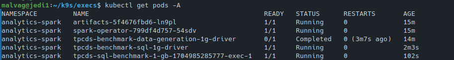

# Examples

## Spark Analytics - TPCDS Benchmark


TPC-DS is an industry standard benchmark for measuring the performance of data processing systems. We run an implementation that uses Spark SQL, orchestrated via the Spark Operator (an integration provided by Amazon for EKS [eks-spark-benchmark](https://github.com/aws-samples/eks-spark-benchmark)), to evaluate how HPK handles Spark-based workloads as they would typically be deployed in the Cloud. The operator streamlines the deployment and management of Apache Spark applications on Kubernetes by defining the <em>SparkApplication</em> CRD.
Users can efficiently version, share, and reproduce runs by employing declarative configuration of their <em>SparkApplications</em> in YAML or JSON.
The operator handles the entire lifecycle of execution, including submission, scaling, and cleanup, and provides logging and monitoring mechanisms for enhanced visibility into performance.

First, we deploy the Spark Operator and MinIO via Helm.
MinIO is an S3-compatible storage system, used to store the generated data. The benchmark requires a data generation phase before the actual submission of the workload. The benchmark YAMLs require that the S3 service is named <em>spark-k8s-data</em>, so this needs to be adjusted when deploying MinIO.

Once the supporting tools are ready, we submit the data generation and the benchmark <em>SparkApplications</em> in series, optionally adjusting the number executors and their resource requirements as shown bellow (the example YAMLs use 1 executors, each occupying 1 CPU core). The same <em>SparkApplication</em> YAMLs, without any changes, run in both a regular Cloud setting and HPK.

```yaml
apiVersion: "sparkoperator.k8s.io/v1beta2"
kind: SparkApplication
metadata:
  name: tpcds-benchmark-data-generation-1g
spec:
  ...
  executor:
    instances: 1
    cores: 1
    memory: "1000m"
```

You can run this workflow (setup, execution, monitoring, cleanup) using two two scripts available in our repo:
```bash
cd HPK/examples/apps/analytics-spark/
./tpcds.sh

# to cleanup everything
./uninstall.sh
```

